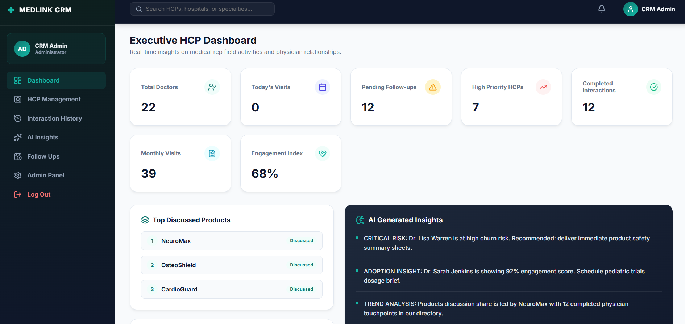

# MedLink – AI-First CRM HCP Module


[](https://reactjs.org/)
[](https://redux.js.org/)
[](https://fastapi.tiangolo.com/)
[](https://www.python.org/)
[](https://langchain-ai.github.io/langgraph/)
[](https://groq.com/)
[](https://www.postgresql.org/)
[](https://tailwindcss.com/)
[](https://vitejs.dev/)

MedLink CRM is an enterprise-grade, high-fidelity healthcare customer relationship management system specializing in the Healthcare Professional (HCP) module. It provides medical representatives with a dual-logging system to record visits either through a structured, real-time auto-saving form, or via a Microsoft Copilot-style AI conversation powered by **FastAPI** and a compiled **LangGraph** stateful agent workflow.


## 📖 Overview

MedLink CRM bridges the gap between conversational ease and database structure for Medical Representatives in the field. When visiting doctors, representatives can log clinical discussions, product interests, follow-ups, and feedback. Instead of spending hours navigating tedious data tables, they can simply type or speak to the MedLink AI Copilot, which parses, summarizes, schedules follow-ups, and structures the data directly into a production-ready PostgreSQL database.

---

## ❓ Why this project?

Enterprise healthcare CRMs (like Veeva or Salesforce Health Cloud) are often complex, slow, and tedious to populate. This project was developed as a solution to:
1. **Reduce Admin Overhead for Reps:** Allow voice and conversational visit logging.
2. **Standardize Data Quality:** Use LLMs with structured outputs (via LangGraph) to automatically extract products discussed, follow-ups, and clinical priorities.
3. **Bridge Chat and Form Workflows:** Ensure that any conversation immediately generates a structured, editable form preview for validation before saving.

---

## ✨ Key Features

| Feature | Description | Key Tech / UI Detail |
| :--- | :--- | :--- |
| **Dual-Logging Console** | Record doctor visits using a structured form or an interactive, conversational chat portal. | React, Redux, Lucide Icons |
| **Stateful AI Copilot** | Processes voice transcriptions and text logs through a structured reasoning graph. | LangGraph, Groq, `gemma2-9b-it` |
| **Interactive AI Panel** | Real-time clinical insights, churn risk alerts, engagement scores, and sentiment dials. | Framer Motion, Axios |
| **AI Visit Summary** | Generates collapsable cards highlighting clinical feedback, sentiment, and follow-ups. | LangGraph, JSON Parsing |
| **PDF Visit Reports** | Produces printable, beautifully styled A4 PDF visit reports including AI summaries. | Native Print Window, Tailwind CSS |
| **HCP Management** | Direct catalog of physicians, specialties, active follow-ups, and engagement histories. | FastAPI, PostgreSQL / SQLite |
| **Admin Panel** | Configure system presets, database connection variables, and API credentials. | AdminGuard, Route Guards |

---

## 🖼️ Screenshots

### 1. Executive HCP Dashboard

*Figure 2: Real-time dashboard depicting overall doctor statistics, daily schedules, monthly trends, and AI trend bulletins.*

---

### 2. Form-Based Logging Console

*Figure 3: Form-based interaction console with auto-saving, product pill selection, and scheduling.*

---

### 3. Conversational AI Copilot

*Figure 4: AI chat interface showing interactive entity extraction cards generated on-the-fly.*

---

### 4. Advanced Clinical AI Insights

*Figure 5: AI Insights Panel showcasing clinical sentiments, churn risk alerts, and historical engagement scores.*

---

### 5. Follow-ups Scheduler

*Figure 6: Interactive agenda list detailing pending, overdue, and completed follow-up requirements.*

---

### 6. Interactive HCP Management

*Figure 7: Management dashboard for creating, reading, updating, and archiving doctor directory items.*

---

### 7. Interaction Log Feed

*Figure 8: Auditable chronological history feed of all representative logs.*

---

## 🧠 AI Workflow

The AI workflow bridges conversational entries and database records using these stages:

```
[Conversational Voice/Text] ──> [Groq LLM Client] ──> [LangGraph State Machine]
                                                             │
                                                             ├──> [Tool Call Selection]
                                                             │
                                                             └──> [JSON Output Compiler]
                                                                     │
  [Interactive Preview Card] <── [Redux State Dispatch] <────────────┘
```

1. **Input Stage:** The representative inputs text or converts audio to text using the mic.
2. **Orchestration Stage:** The query goes to the FastAPI backend, which initiates a LangGraph state transaction.
3. **Execution Stage:** The graph decides if a database tool is needed (e.g., searching or writing records).
4. **Compilation Stage:** The LLM returns a structured JSON package containing the parsed details, which are dispatched to the React frontend.

---

## 📐 LangGraph Architecture

Unlike linear LLM chatbots, MedLink uses **LangGraph**'s stateful, multi-node configuration to execute tasks deterministically.


* **Reasoning Node:** Inspects history and analyzes user intent using `gemma2-9b-it`.
* **Conditional Router:** Reads the planned state and routes to `Tools` or branches directly to `Compiler`.
* **Tools Node:** Executes database actions via Python backend functions.
* **Compiler Node:** Gathers outputs and populates analytics charts (sentiment score, risk alerts).

---

## 🛠️ The 5 LangGraph Tools

| Tool Name | Purpose | Input | AI Processing | Output |
| :--- | :--- | :--- | :--- | :--- |
| **`log_interaction`** | Records a new doctor visit | `hcp_name`, `notes`, `products_discussed`, `date` | Matches doctor, seeds new profile if absent, extracts priorities | Staged database row details |
| **`edit_interaction`** | Modifies existing visits | `interaction_id`, fields to update | Validates ID and updates targeted DB fields | Status success confirmation |
| **`search_interactions`**| Search visit logs | query term | Searches text fields, notes, and database records | List of matching interactions |
| **`schedule_followup`** | Assigns follow-up dates | `follow_up_date`, details | Parses natural language dates and creates follow-ups | Scheduled task details |
| **`get_hcp_insights`** | Fetches doctor statistics | `hcp_name` | Pulls analytics, churn metrics, and priority score | Insights object |

---

## 💻 Technology Stack

* **Frontend:** React 18, Redux Toolkit, React Router v6, Axios, Framer Motion, Vanilla CSS
* **Backend:** FastAPI, Python 3.10+, LangGraph, SQLAlchemy (PostgreSQL & SQLite)
* **LLM Engine:** Groq API Client (`gemma2-9b-it` model)
* **Deployment:** Render Blueprint Spec (`render.yaml`), PostgreSQL database service

---

## 📂 Project Structure

```
MedLink/
├── backend/                      # FastAPI Backend Server
│   ├── database/                 # Database initialization & connections
│   │   ├── __init__.py
│   │   └── connection.py         # SQLAlchemy connection helper (PostgreSQL/SQLite)
│   ├── langgraph/                # Multi-Agent StateGraph Workflow
│   │   ├── __init__.py
│   │   ├── graph.py              # Main graph compilation
│   │   ├── nodes.py              # Agent task nodes (Reasoning, Tools, Compiler)
│   │   ├── router.py             # Conditional routing rules
│   │   └── state.py              # Agent state schema
│   ├── models/                   # DB Models
│   │   ├── __init__.py
│   │   └── models.py             # HCP & Interaction tables
│   ├── routes/                   # API routes
│   │   ├── __init__.py
│   │   ├── hcps.py               # HCP directory APIs
│   │   └── interactions.py       # visit logging APIs
│   ├── tools/                    # LLM Tool execution definitions
│   │   ├── __init__.py
│   │   ├── edit_interaction.py
│   │   ├── followup_tool.py
│   │   ├── hcp_insights.py
│   │   ├── log_interaction.py
│   │   └── search_interaction.py
│   ├── requirements.txt          # Python packaging requirements
│   └── main.py                   # API Entry & db seeding hook
├── frontend/                     # React Single Page Application (SPA)
│   ├── src/
│   │   ├── assets/               # Local static assets
│   │   ├── components/           # Generic atomic elements & layouts
│   │   │   ├── AIIndicator.tsx
│   │   │   ├── AIPanel.tsx       # AI Insights Sidepanel
│   │   │   ├── Button.tsx
│   │   │   ├── Card.tsx
│   │   │   ├── DoctorFormModal.tsx
│   │   │   ├── FormField.tsx
│   │   │   ├── MedLinkLogo.tsx   # SVG Branding Logo
│   │   │   ├── NotificationToast.tsx
│   │   │   ├── RouteGuard.tsx    # Authentication guard
│   │   │   ├── Skeleton.tsx      # AI Shimmer loaders
│   │   │   └── Timeline.tsx      # Interaction logs feed
│   │   ├── layouts/
│   │   │   └── MainLayout.tsx    # Sidebar/Navbar responsive chrome
│   │   ├── pages/                # Screen routers
│   │   │   ├── AdminPanel.tsx    # App global configs
│   │   │   ├── AIInsights.tsx    # Advanced analytics graphs
│   │   │   ├── Dashboard.tsx     # KPI metrics & graphs
│   │   │   ├── FollowUps.tsx     # Visit schedule agenda
│   │   │   ├── HCPDirectory.tsx  # Interactive catalog
│   │   │   ├── HCPManagement.tsx # Administrator control table
│   │   │   ├── History.tsx       # List feed
│   │   │   ├── LogInteraction.tsx# Structured Form / AI chat logs
│   │   │   ├── Login.tsx         # Dark glassmorphism portal
│   │   │   └── Placeholders.tsx
│   │   ├── redux/                # Global RTK state management
│   │   │   ├── slices/           # Slices for chat, auth, hcps, interactions
│   │   │   └── store.ts
│   │   ├── services/             # Axios request adapters
│   │   └── utils/                # Mock datasets & helpers
│   ├── package.json              # NPM dependencies
│   ├── vite.config.ts            # Vite compile configs
│   └── tsconfig.json
├── images/                       # Project system screenshots for README
├── render.yaml                   # Infrastructure-as-code spec for Render deployments
├── .env.example                  # Template env configs
└── README.md                     # This file
```

---

## ⚙️ Installation & Setup

### Prerequisites
* Node.js (v18+)
* Python (v3.10+)
* PostgreSQL (Optional, defaults to local SQLite)

### 1. Environment Config
Clone the template file to create `.env` in the root:
```bash
cp .env.example .env
```
Fill in your configurations:
```properties
DATABASE_URL=sqlite:///./healthcare_crm.db
GROQ_API_KEY=gsk_your_groq_key_here
```

### 2. Backend Setup
```bash
cd backend
python -m venv venv

# On Windows:
.\venv\Scripts\activate
# On macOS/Linux:
source venv/bin/activate

pip install -r requirements.txt
python -m uvicorn main:app --reload --port 8000
```
*Backend runs at `http://localhost:8000`. Swagger API docs are accessible at `/docs`.*

### 3. Frontend Setup
```bash
cd frontend
npm install
npm run dev
```
*Frontend runs at `http://localhost:5173`.*

---

## 🔌 API Overview

### Interactions
* `GET /api/interactions` - Fetch visit history.
* `POST /api/interactions` - Save structured visit logs.
* `PUT /api/interactions/{id}` - Modify interaction details.
* `DELETE /api/interactions/{id}` - Delete interaction row.

### HCP Directory
* `GET /api/hcps` - List doctors, specialties, and stats.
* `POST /api/hcps` - Create a new doctor profile.

### Dashboard Stats
* `GET /api/dashboard/stats` - Fetch real-time KPI metrics.

### AI Copilot Chat
* `POST /api/chat` - Process conversation log through LangGraph nodes.

---

## 🔄 Why LangGraph over standard chatbots?

Traditional chatbots run on a single LLM loop that generates responses based purely on system prompts. This is error-prone for database operations. 
**LangGraph** was selected because:
1. **Deterministic Pathing:** It structures agent execution as a state machine. It does not hallucinate whether to run database tools; it follows node routing logic.
2. **State Persistence:** The `AgentState` persists data variables (like extracted entities, sentiment score) through every stage of execution.
3. **Structured Outputs:** It forces the compiler node to format replies in a strictly parsed JSON schema suitable for frontend updates.

---

## 🗄️ Database Design

```
                     +------------------+
                     |       HCP        |
                     +------------------+
                     | id (PK)          |
                     | name             |
                     | hospital         |
                     | specialty        |
                     | engagement_score |
                     | risk_alert       |
                     +--------+---------+
                              | 1
                              |
                              | 0..*
                     +--------v---------+
                     |   Interaction    |
                     +------------------+
                     | id (PK)          |
                     | hcp_id (FK)      |
                     | hcp_name         |
                     | hospital         |
                     | interaction_type |
                     | priority         |
                     | notes            |
                     | sentiment        |
                     +------------------+
```

---

## 🚀 Example User Flow

1. **Rep Log Entry:** A Medical Representative types: 
   * *"Met Dr. Sarah Jenkins at City Cardiology. Discussed CardioGuard. She was highly interested and scheduled a follow-up for next Tuesday."*
2. **AI Action:** The LangGraph agent parses the inputs, matches `Dr. Sarah Jenkins` in the database, extracts `CardioGuard` as the discussed product, and schedules a follow-up.
3. **Form Preview:** An interactive preview card appears in the chat console showing the parsed information.
4. **Database Save:** The Representative clicks "One-Click Save." The data is committed, the dashboard updates, and an **AI Visit Summary** card is generated.
5. **PDF Report:** The Representative clicks "Download Visit Report" to export a clean, printable PDF of the interaction.

---

## 💡 Future Enhancements

* **Offline Capabilities:** Local sync storage using IndexedDB for logging visits when hospital networks are disconnected.
* **Audio Voice Processing:** Implement on-device Whisper audio recording directly to the FastAPI API stream.
* **Veeva / Salesforce Sync Integrations:** Export APIs to sync fields with enterprise healthcare CRM systems.

---

## 📝 License

Distributed under the MIT License. See `LICENSE` for more information.
